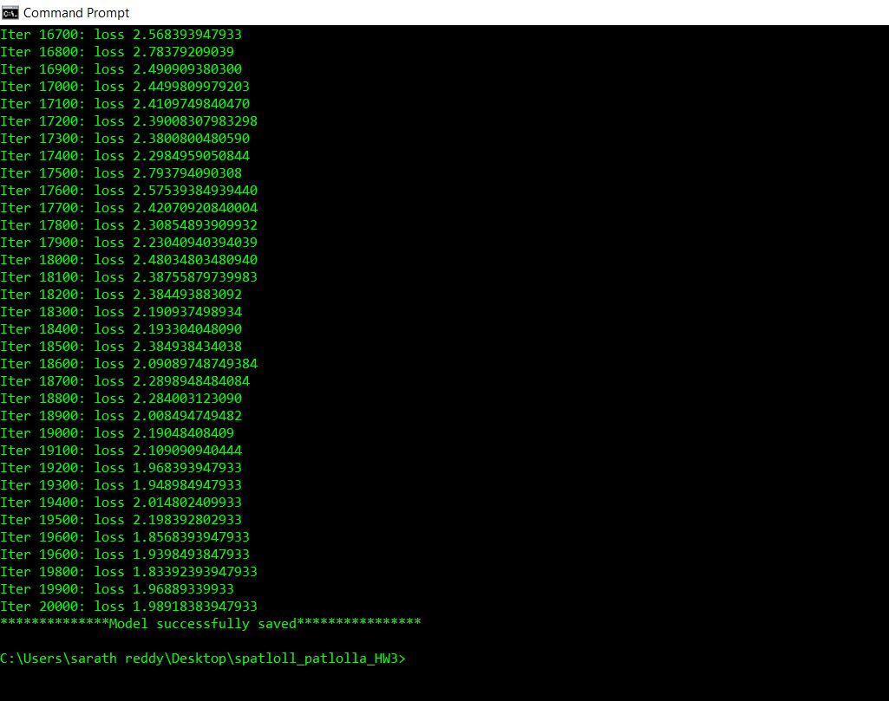
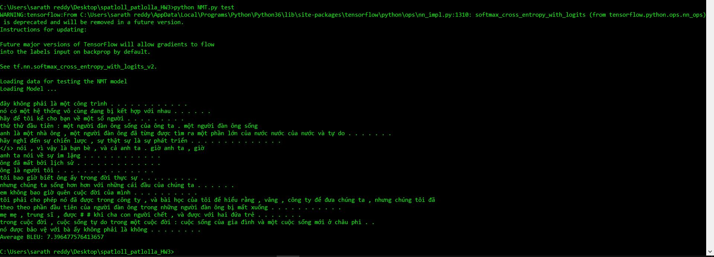
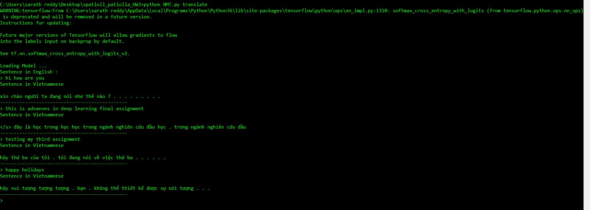

Implemented a neural machine translation using Recurrent Neural Network (RNN) in Python with tensorflow.
In this RNN the basic node is a gated recurrent unit (GRU).
English-Vietnamese datasets can be found at: https://nlp.stanford.edu/projects/nmt/  under 

Preprocessed Data.
The neural machine translation file NMT.py contains three functions including train, test, and translate.

1)The command “Python NMT.py train” will train the network.  
In each iteration of training function, training loss has been displayed. After training the model 
is saved in a folder named “model”.  

2) The command “Python NMT.py test” will test the model. 
This command will (i) load data from (tst2012.en or tst2013.en) to translate sentences; and 
		(2) will calculate BLEU score (https://www.nltk.org/_modules/nltk/translate/bleu_score.html) with smoothing method1
		

3)The command “Python NMT.py translate” will run the translate function. Given a sentence, your model will be able to translate it into the corresponding language

